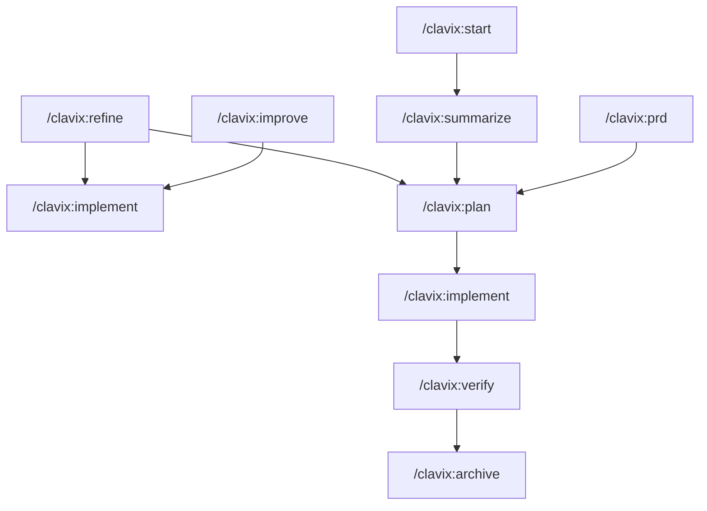

# Clavix

> Agentic-first prompt workflows. Markdown templates that teach AI agents how to optimize prompts, create PRDs, and manage implementation. Works with Claude Code, Cursor, Windsurf, and 20 AI coding tools.

## Quick Links

| I want to... | Go to |
|--------------|-------|
| Get started | [Quickstart](#quickstart) |
| See all commands | [docs/commands.md](docs/commands.md) |
| Understand the architecture | [docs/architecture.md](docs/architecture.md) |
| Check integrations | [docs/integrations.md](docs/integrations.md) |
| Contribute | [CONTRIBUTING.md](CONTRIBUTING.md) |

## Command Format

**Your command format depends on your AI tool:**

| Tool Type | Format | Example |
|-----------|--------|---------|
| **CLI tools** (Claude Code, Gemini, Qwen) | Colon (`:`) | `/clavix:improve` |
| **IDE extensions** (Cursor, Windsurf, Cline) | Hyphen (`-`) | `/clavix-improve` |

**Rule of thumb:** CLI tools use colon, IDE extensions use hyphen.

## Quickstart

### 1. Install and Initialize

```bash
npm install -g clavix
clavix init
```

### 2. Use Slash Commands

```
/clavix:improve "Create a secure login page with JWT"
```

The AI agent reads the template and optimizes your prompt.

### 3. Choose Your Workflow



#### Quick Path (Simple Tasks)
```
/clavix:improve → /clavix:implement
```
Optimize a prompt and implement it directly.

#### Full Planning (Complex Features)
```
/clavix:prd → /clavix:plan → /clavix:implement → /clavix:verify → /clavix:archive
```
Structured planning with PRD, task breakdown, implementation, verification, and archival.

#### Exploratory (Discovery Mode)
```
/clavix:start → [conversation] → /clavix:summarize → /clavix:plan
```
Have a conversation to explore requirements, then extract and plan.

#### Refinement (Iteration)
```
/clavix:refine → (updated PRD or prompt) → continue workflow
```
Refine existing PRDs or prompts based on feedback.

### All 9 Slash Commands

| Command | Purpose |
|---------|---------|
| `/clavix:improve` | Optimize prompts (auto-selects depth) |
| `/clavix:prd` | Generate PRD through guided questions |
| `/clavix:plan` | Create task breakdown from PRD |
| `/clavix:implement` | Execute tasks or prompts |
| `/clavix:start` | Begin conversational session |
| `/clavix:summarize` | Extract requirements from conversation |
| `/clavix:refine` | Refine existing PRD or prompt |
| `/clavix:verify` | Verify implementation against requirements |
| `/clavix:archive` | Archive completed projects |

See [Getting Started](docs/getting-started.md) for the full guide.

## How It Works

Clavix is **agentic-first**:

1. **You run `clavix init`** - Sets up slash command templates
2. **You invoke a slash command** - Like `/clavix:improve`
3. **AI agent reads the template** - Markdown instructions
4. **Agent follows instructions** - Using its native tools
5. **Output is saved** - To `.clavix/outputs/`

**No TypeScript executes during slash commands.** The markdown templates ARE the product.

See [Architecture](docs/architecture.md) for details.

## Supported AI Tools

| Category | Tools |
|----------|-------|
| IDE extensions | Cursor, Windsurf, Kilocode, Roocode, Cline |
| CLI agents | Claude Code, Gemini CLI, Qwen Code, Droid CLI, CodeBuddy, OpenCode, LLXPRT, Amp, Crush CLI, Codex CLI, Augment CLI |
| Universal | AGENTS.md, GitHub Copilot, OCTO.md, WARP.md |

Full list: [docs/integrations.md](docs/integrations.md)

## CLI Commands

| Command | Purpose |
|---------|---------|
| `clavix init` | Initialize Clavix in a project |
| `clavix update` | Regenerate templates |
| `clavix diagnose` | Check installation |
| `clavix version` | Show version |

All workflows (`/clavix:improve`, etc.) are **slash commands** that AI agents execute.

## Documentation

- [Getting Started](docs/getting-started.md) - Installation and first workflow
- [Commands Reference](docs/commands.md) - All commands in one place
- [Architecture](docs/architecture.md) - How Clavix works
- [Integrations](docs/integrations.md) - Full tool matrix
- [CONTRIBUTING.md](CONTRIBUTING.md) - Contribute to Clavix

## Requirements

- **Node.js >= 18.0.0**
- npm or yarn
- An AI coding tool (Claude Code, Cursor, etc.)

## License

Apache-2.0

## Star History

<a href="https://www.star-history.com/#ClavixDev/Clavix&type=date&legend=top-left">
 <picture>
   <source media="(prefers-color-scheme: dark)" srcset="https://api.star-history.com/svg?repos=ClavixDev/Clavix&type=date&theme=dark&legend=top-left" />
   <source media="(prefers-color-scheme: light)" srcset="https://api.star-history.com/svg?repos=ClavixDev/Clavix&type=date&legend=top-left" />
   
 </picture>
</a>
