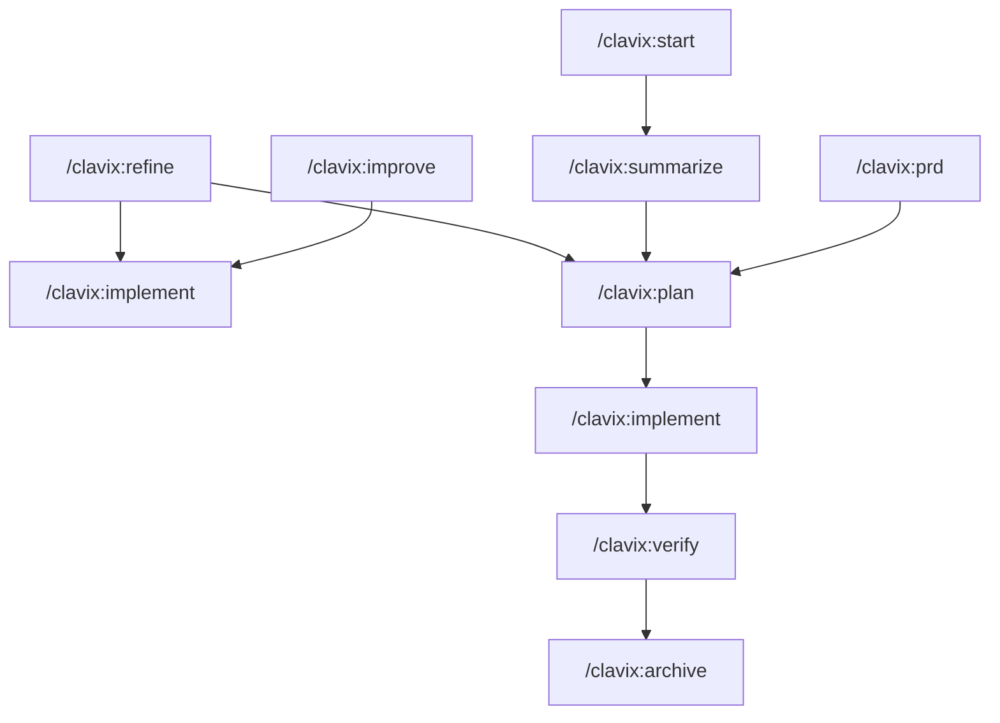

# Clavix

> Agentic-first prompt workflows. Markdown templates that teach AI agents how to optimize prompts, create PRDs, and manage implementation. Works with Claude Code, Cursor, Windsurf, GitHub Copilot, and many AI coding tools.

## Quick Links

| I want to... | Go to |
|--------------|-------|
| Get started | [Quickstart](#quickstart) |
| See all commands | [docs/commands.md](docs/commands.md) |
| Understand the architecture | [docs/architecture.md](docs/architecture.md) |
| Check integrations | [docs/integrations.md](docs/integrations.md) |
| Contribute | [CONTRIBUTING.md](CONTRIBUTING.md) |

## Command Format

**Your command format depends on your AI tool:**

| Tool Type | Format | Example |
|-----------|--------|---------|
| **CLI tools** (Claude Code, Gemini, Qwen) | Colon (`:`) | `/clavix:improve` |
| **IDEs & extensions** (Cursor, Windsurf, Cline, GitHub Copilot) | Hyphen (`-`) | `/clavix-improve` |

**Rule of thumb:** CLI tools use colon, IDE extensions use hyphen.

## Quickstart

### 1. Install and Initialize

```bash
npm install -g clavix
clavix init
```

During `clavix init`, pick your AI tools (Cursor, Claude Code, GitHub Copilot, etc.). Clavix installs slash command templates into those integrations.

### 2. Use Slash Commands

```text
# CLI-style tools (Claude Code, Gemini, Qwen)
/clavix:improve "Create a secure login page with JWT"

# IDE-style tools (Cursor, Windsurf, GitHub Copilot, etc.)
/clavix-improve "Create a secure login page with JWT"
```

The AI agent reads the Clavix template and optimizes your prompt.

### 3. Choose Your Workflow



#### Quick Path (Simple Tasks)
```
/clavix:improve → /clavix:implement
```
Optimize a prompt and implement it directly.

#### Full Planning (Complex Features)
```
/clavix:prd → /clavix:plan → /clavix:implement → /clavix:verify → /clavix:archive
```
Structured planning with PRD, task breakdown, implementation, verification, and archival.

#### Exploratory (Discovery Mode)
```
/clavix:start → [conversation] → /clavix:summarize → /clavix:plan
```
Have a conversation to explore requirements, then extract and plan.

#### Refinement (Iteration)
```
/clavix:refine → (updated PRD or prompt) → continue workflow
```
Refine existing PRDs or prompts based on feedback.

### All 10 Slash Commands

| Command | Purpose |
|---------|---------|
| `/clavix:improve` | Optimize prompts (auto-selects depth) |
| `/clavix:prd` | Generate PRD through guided questions |
| `/clavix:plan` | Create task breakdown from PRD |
| `/clavix:implement` | Execute tasks or prompts |
| `/clavix:start` | Begin conversational session |
| `/clavix:summarize` | Extract requirements from conversation |
| `/clavix:refine` | Refine existing PRD or prompt |
| `/clavix:verify` | Verify implementation against requirements |
| `/clavix:review` | Review teammate PRs using criteria presets |
| `/clavix:archive` | Archive completed projects |

`/clavix:review` is for reviewing teammates' PRs (criteria-driven, severity levels, saved reports), while `/clavix:verify` checks your implementation against your own PRD.

For a full walkthrough, see [Getting Started](docs/getting-started.md).

## How It Works

Clavix is **agentic-first**:

1. **You run `clavix init`** – Select integrations (Cursor, Claude Code, GitHub Copilot, etc.). Clavix installs markdown templates into each tool (e.g. `.cursor/commands/`, `.github/prompts/clavix-*.prompt.md`).
2. **You invoke a slash command** – Like `/clavix:improve`, `/clavix:plan`, or `/clavix:review` in your AI tool.
3. **The AI agent reads the template** – Structured markdown instructions with frontmatter.
4. **The agent follows the instructions** – Using its native tools (edit files, run tests, summarize, review PRs, etc.).
5. **Outputs are saved locally** – Under `.clavix/outputs/` (including `.clavix/outputs/reviews/` for PR review reports).

**No TypeScript executes during slash commands.** The markdown templates ARE the product; Clavix only installs and updates them.

See [Architecture](docs/architecture.md) for details.

## Supported AI Tools

| Category | Tools |
|----------|-------|
| IDEs & extensions | Cursor, Windsurf, Kilocode, Roocode, Cline, GitHub Copilot (VS Code) |
| CLI agents | Claude Code, Gemini CLI, Qwen Code, Droid CLI, CodeBuddy, OpenCode, LLXPRT, Amp, Crush CLI, Codex CLI, Augment CLI, Vibe CLI |
| Universal formats | AGENTS.md, OCTO.md, WARP.md |

In GitHub Copilot Chat, Clavix commands appear as `/clavix-improve`, `/clavix-prd`, `/clavix-review`, etc.

Full list: [docs/integrations.md](docs/integrations.md)

## CLI Commands

| Command | Purpose |
|---------|---------|
| `clavix init` | Initialize or reconfigure Clavix integrations in a project |
| `clavix update` | Regenerate templates for selected integrations |
| `clavix diagnose` | Check installation and integration health |
| `clavix version` | Show version |

All workflows (`/clavix:improve`, `/clavix:plan`, `/clavix:review`, etc.) are **slash commands** that your AI tools execute using Clavix templates.

## Documentation

- [Getting Started](docs/getting-started.md) - Installation and first workflow
- [Commands Reference](docs/commands.md) - All commands in one place
- [Architecture](docs/architecture.md) - How Clavix works
- [Integrations](docs/integrations.md) - Full tool matrix
- [CONTRIBUTING.md](CONTRIBUTING.md) - Contribute to Clavix

## Requirements

- **Node.js >= 18.0.0**
- npm or yarn
- An AI coding tool (Claude Code, Cursor, GitHub Copilot, etc.)

## License

Apache-2.0

## Star History

<a href="https://www.star-history.com/#ClavixDev/Clavix&type=date&legend=top-left">
 <picture>
   <source media="(prefers-color-scheme: dark)" srcset="https://api.star-history.com/svg?repos=ClavixDev/Clavix&type=date&theme=dark&legend=top-left" />
   <source media="(prefers-color-scheme: light)" srcset="https://api.star-history.com/svg?repos=ClavixDev/Clavix&type=date&legend=top-left" />
   
 </picture>
</a>
